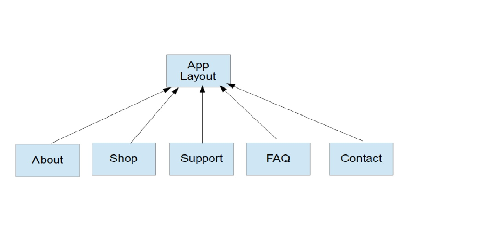

# Layouts

So far we have looked at very simple views in Laravel, essentially copying an entire HTML file to a blade file, then calling that file as the view for a route.

If we continued along that path, we might end up with a hundred or more files, depending on the size of our site.

Worse, because of repeating style blocks, javascript blocks, etc, we will end up duplicating a lot of code that may need editing at some point.

## Object Oriented Views

Laravel's solution to this problem, which we would otherwise have solved in oour previous projects by simply including commong elements, is to take an Object Oriented Approach.

In Laravel we can set a Parent view (a layout), that is then extended by child views.



In this way, a common layout is used for all pages (sharing CSS, Javascript, header, footer, and basic layout) but having unique view content.  This is accomplished using the view `yield` declaration.

This is a typical layout, containing all the common elements.  The view can provide the `content` that will be yielded into the layout.

```php

	<!DOCTYPE html>
	<html>
	<head>
		<title>My App</title>
		<link rel="stylesheet" href="/css/app/css" />
		<script src="/js/app.js"></script>
		<title>{{ title }} | My App</title>
	</head>
	<body>

		<div class="container">

		<!-- Start view content -->

			@yield('content')

		<!-- End view content -->

		</div><!-- /.container -->

	</body>
	</html>

```
