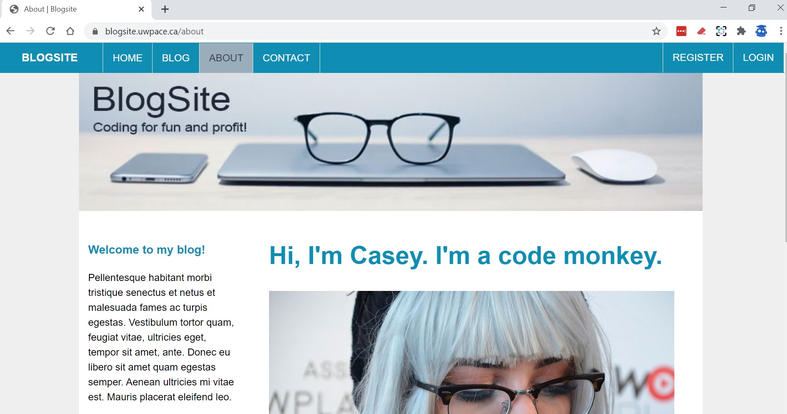

**This lab/quiz is worth 10 marks.**

This lab must be completed and submitted through the Lab #2 Link at [edu.pagerange.com](https://edu.pagerange.com) before 9:00 PM tonight or you will receive zero marks.

In this lab you are going to create the start of a movie web app that shows a list of movies, and the detail for specific movies.


## Follow these steps


1. Create a new Laravel Project in your PHP MVC repository named quiz2

```bash
composer create-project laravel/laravel lab2 ^7
```

2. Use artisan to generate a migration for a table named `movies`. In addition to the id and timestamp fields, a it will require the following fields:

* title (a string)
* director (a string)
* running_time (an integer)
* image (a string)
* studio (a string)

3. Run your migrations to create the table

4. Use artisan to generate a model for the `movies` table

5. Use artisan to generate a controller for the movies table (not a resource controller!)

6. Create and use a seeder to populate your database table.  The image field should contain the filename of an image.  You will need to source a handful of images from the web to use in this quiz.  They should be stored in the `public/images` folder.  Create a total of 5 movies with your seeder.

7. Create three routes. Each route should accept at a minimum, a `$title` variable.  The list and detail views will also need to accept the data they require for output.

* A home page route 
* A movies route. This will show the list of movies in an unordered list. (title only)
* A movie detail route. This will show the detail for a movie (all fields).  

8. Create a Controller to handle the routes

Create a controller, `MoviesController` to handle your routes.  DO NOT create a resource controller.  But DO create the standard, conventional methods required to handle the list and detail views.  

8. Create views for each route

* The views related to movie data should be in a subfolder named `movies` and should follow Laravel naming conventions for views
* The home page view can be stored outside the `movies` folder

9. When you are finished take screenshots of the following pages: home, movies, movie detail.  Make sure your screenshot includes the address-bar of your browser, showing the route, or you will not receive marks for your screenshots.  There should be three screenshots in total.  DO NOT ADD THESE TO A WORD DOCUMENT OR PDF.  Sample screenshot:



10. Export your git log into a text file

Export your git log using the following command, into a file name gitlog.txt.  Include the gitlog in the zip archive you will be submitting.

```bash
git --no-pager log > gitlog.txt
```


## Keep in mind

Please remember, you are expected to work using the best practices you have learned so far:

* Use Git and keep a complete log in case you are questioned about your work
* Comment all code, including DocBlocks above all methods and functions
* Follow PSR-2 standards for line-length, code formatting


## What to hand in

* A single zip archive containing the following (maximum size 8M):
	- Minimum 3 screenshots, each meeting the specifications above
	- Your `web.php` file with all your routes
	- Your `MoviesController` file with all your controller methods
	- Your list view
	- Your detial view
	- Your home view
	- Your git log


__END__